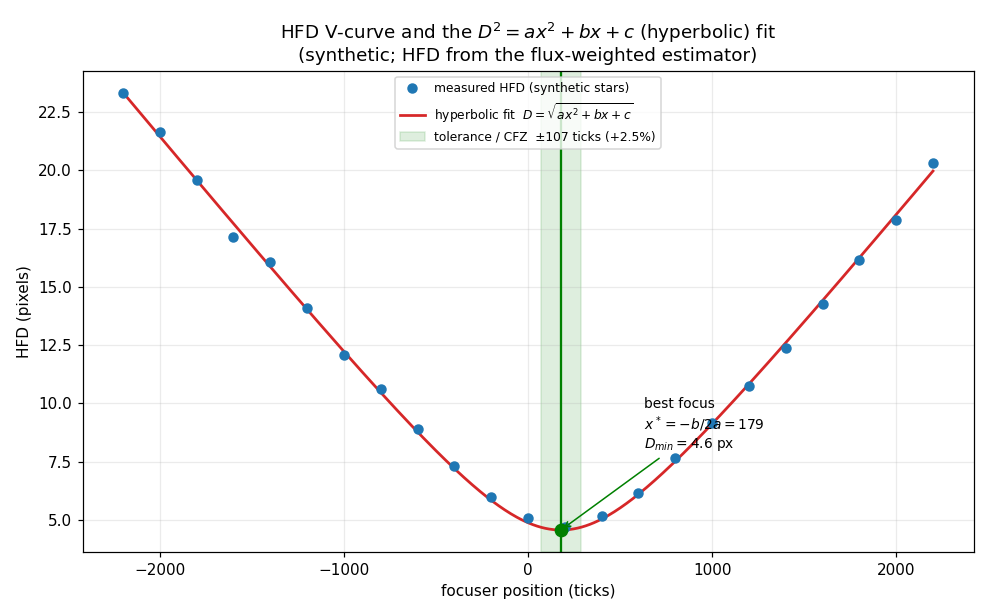
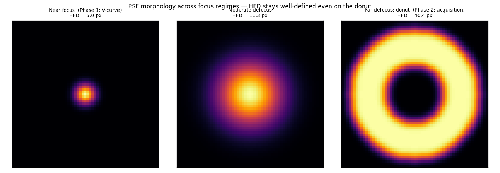

# Self-contained HFD autofocus — design & methodology

*MAST unit calibration · planned `src/imaging/hfd.py` + `src/focus_analysis_hfd.py`,
parallel to the existing ps3cli autofocus in `src/autofocusing.py`*

This note documents the design for a self-contained autofocus routine for a MAST
unit: how it measures focus from a sky image, the theory behind the metric and
the fit, the planned implementation, and the literature it rests on. It is
written for review by an optics/instrumentation specialist.

> **Status (read first):** this is a **design**, not yet implemented. The unit
> today autofocuses via PlaneWave's external **ps3cli** analyzer (star RMS
> diameter → V-curve). The routine here adds a **self-contained Half-Flux Diameter
> (HFD)** path **in parallel** (it does not replace ps3cli), so the two can be run
> on the same images and compared. The Phase-1 metric/fit choices are validated by
> established practice; the Phase-2 (donut) and Phase-3 (thermal) elements are
> design intent to be characterized on real data. See [§6](#6-status--limitations).

---

## 1. Purpose & regime

Each MAST unit is a **0.6 m f/3 paraboloid**. Robotic operation needs an
autofocus that (a) runs **offline** — no external server or star catalog — and
(b) is robust on a **fast, coma-driven** system whose off-axis PSFs are
asymmetric even at best focus. We measure focus with the **Half-Flux Diameter
(HFD)**, sweep the focuser to trace a V-curve, and fit it for best focus.

Three regimes must be handled: **near focus** (point sources — the V-curve),
**far defocus** (the central obstruction makes stars **donuts** — a coarse
acquisition), and **routine** runs (seed from a cached/temperature-predicted
focus so most runs are a short confirm).

---

## 2. Theory basis

### 2.1 Half-Flux Diameter and its estimator

The HFD is the diameter of the circle, centred on the star's brightness
centroid, that contains **half** the background-subtracted flux. The standard
production estimator is twice the flux-weighted mean radius

$$ \text{HFD} \;=\; 2\,\frac{\sum_i v_i\, r_i}{\sum_i v_i}, $$

with $v_i$ the background-subtracted pixel value (clamped $\ge 0$) and $r_i$ the
distance from the centroid, summed within an aperture $r_{\text{out}}$. For a
Gaussian PSF of width $\sigma$ the flux-weighted mean radius is $\sigma\sqrt{\pi/2}$,
so $\text{HFD} = \sigma\sqrt{2\pi}\approx 2.507\,\sigma$ — a clean scalar
proportional to PSF size. (Note: this weighted-mean form is a *relative* focus
index, not exactly the 50%-encircled-energy diameter; the two coincide only for
radially symmetric PSFs.)

### 2.2 Why HFD over FWHM / Gaussian-fit / RMS

FWHM, Gaussian-fit width, and peak-based metrics locate the PSF **peak** — which
seeing corrupts and which **vanishes entirely** for an annular (donut) star with
a dark centre. HFD instead **integrates flux** over many pixels about the
brightness centroid, so it stays defined and monotonic from sharp focus all the
way out to donuts. This is exactly why it is the de-facto metric in production
autofocusers (FocusMax, MaxIm DL, N.I.N.A. via the half-flux *radius*, ASTAP).
For an f/3 parabola, where coma makes off-axis cores asymmetric, an integral
metric is doubly preferable to a peak/profile fit. **Caveat:** at low SNR the HFD
becomes sensitive to the assumed background and can even go negative on a noise
valley — so a solid local background and a minimum-SNR cut are required,
especially during cold-start.

### 2.3 Defocus → blur → the V-curve

Geometric defocus blurs a star into a disc whose diameter grows **linearly** with
the focuser offset from best focus and inversely with the focal ratio. Convolved
with the seeing core, HFD versus focuser position $x$ is therefore a **hyperbola**

$$ \text{HFD}(x) \;=\; \sqrt{a\,x^{2} + b\,x + c}, $$

whose two asymptotes are the linear V-sides and which rounds only near the
vertex — "linear except very close to best focus." Squaring linearises it:

$$ D^{2} \;=\; a\,x^{2}+b\,x+c \quad(\text{a parabola in }x), $$

fit by ordinary (better: error-weighted) least squares, e.g. `np.polyfit(x, D**2, 2)`.
With $a>0$ the best focus and minimum diameter are

$$ x^{*} = -\frac{b}{2a}, \qquad D_{\min} = \sqrt{\,c - \frac{b^{2}}{4a}\,}. $$

### 2.4 Tolerance and the Critical Focus Zone

The **tolerance** is the focuser offset at which the fitted diameter rises by a
set fraction $f$ (e.g. 2.5 %):

$$ \Delta x \;=\; \sqrt{\frac{D_{\min}^{2}\big((1+f)^{2}-1\big)}{a}}. $$

This is the empirical analogue of the optical **Critical Focus Zone (CFZ)**, the
defocus over which the wavefront error stays below the diffraction limit. The CFZ
scales as roughly the **square of the focal ratio**, $\text{CFZ}\propto N^{2}$, so
it is **tight at f/3** — the V-curve sample spacing and fine step must be set
accordingly.

### 2.5 Donuts, and the inside/outside-focus sign ambiguity

Far from focus the **central obstruction** turns each star into an annular
**donut** whose outer diameter grows with $|x-x^{*}|$. Crucially, defocus is an
**even** (radially symmetric) wavefront term, so to first order an image the same
distance **inside** focus is nearly identical to one **outside** focus: the blur
**diameter alone cannot determine the direction** to best focus. The established
resolution is a **differential (paired intra-/extra-focal) measurement** — a small
known focuser move whose effect on the diameter reveals the sign. This is the same
principle survey telescopes use for full wavefront recovery (LSST/Rubin curvature
sensing with sensors split ±1 mm about focus; DECam analysing out-of-focus
"donuts" as pupil-plane Zernikes).

### 2.6 Coma is a focus *contaminant* → use near-axis stars

On an uncorrected f/3 parabola, off-axis **coma** inflates and asymmetrises the
PSF, biasing the HFD of margin stars. The focus metric therefore uses only stars
**near the optical axis** (a central radius fraction about the geometric centre,
since the optical centre is unknown during focus) and **avoids the image margins**.
This is the **deliberate opposite** of the unit's optical-centre routine, which
selects *margin* stars precisely because there coma is the signal rather than
noise (see `optical_center_design.md`).

### 2.7 Thermal focus drift

Best focus drifts with temperature (tube/focuser expansion), so once a unit has a
history it can be **seeded** rather than fully swept:

$$ x^{*}_{\text{seed}} \;=\; \text{offset} + \text{slope}\cdot T, $$

a linear model fit robustly over a rolling, recency-weighted history of
$(T,\,x^{*})$ from successful runs. Mirror temperature is the candidate predictor
(it lags ambient); both mirror and ambient are read from PWI4 (§4) so the data can
decide which predicts better.

---

## 3. Methodology — a phased routine

The routine shares one **focuser sweep + pluggable analyzer** spine with the
existing ps3cli path (so `start_autofocus` keeps ps3cli and a new
`start_hfd_autofocus` uses the HFD analyzer, both returning the same status).

- **Phase 0 — Assess (triage).** One exposure at the seed position classifies the
  regime — *near focus* (point sources, near-axis HFD in band) → Phase 1; *far*
  (donuts / huge blob area) → Phase 2; *nothing extracts* → Phase 2 cold-start.
- **Phase 1 — HFD V-curve (near focus).** Step the focuser over $N$ exposures,
  measure the near-axis median HFD per frame, fit $D^{2}=a x^{2}+b x+c$, take
  $x^{*}=-b/2a$ with tolerance $\Delta x$. Persist $x^{*}$ as the unit's
  `known_as_good_position`. **(This phase is the immediate build.)**
- **Phase 2 — Donut acquisition (far from focus).** Blob/threshold-detect donuts,
  use the donut-diameter-vs-defocus slope to **jump** near focus, resolve the sign
  with a **differential move**, then hand off to Phase 1. Cold-start steps coarsely
  until structure appears.
- **Phase 3 — Thermal seed.** Predict $x^{*}_{\text{seed}}$ from temperature, with
  a maturity gate and a degradation ladder (predicted seed → recent-focus flat seed
  → full acquisition), so routine runs are a short confirming V-curve.

**Start-position policy:** the cached `known_as_good_position` selects *where* to
take the Phase-0 frame (else a nominal mid-travel position); Phase 0 then routes.

---

## 4. Implementation plan

All additive and **parallel to ps3cli** (no change to the existing path):

- **`src/imaging/hfd.py`** — `half_flux_diameter(stamp, …)` (§2.1) and
  `frame_hfd(image, …) → (hfd_median, n_stars)` with the **near-axis** cut (§2.6),
  plus `assess_focus_regime(image) → {near|far|empty}` for Phase 0. Reuses the
  photutils detection pattern from `src/imaging/optical_center.py`.
- **`src/focus_analysis_hfd.py`** — `analyze_focus_files_hfd(files, …)`, **reusing
  the existing `PS3FocusAnalysisResult`/`PS3AutofocusStatus` models** so it is a
  drop-in for the orchestrator; parses the focuser position from each `FOCUSnnnnn`
  filename, computes per-frame HFD, fits $D^{2}$, returns best focus + tolerance.
- **Plumbing:** a `start_hfd_autofocus` endpoint, a `UnitActivities.HfdAutofocusing`
  flag, and an HFD config block in `AutofocusConfig`. The shared sweep loop is
  factored out of `do_start_autofocus` and takes the analyzer as a parameter.
- **Temperature source (Phase 3), confirmed on-unit (PWI4 4.1.8):** not in
  `/status`; `GET http://localhost:8220/temperatures/pw1000` returns
  `temperature.primary` (primary **mirror**), `temperature.ambient`,
  `temperature.secondary`, `temperature.m3`, with `-999.000` = no sensor → `None`.

---

## 5. Example figures

Synthetic illustrations; **HFD is computed with the real flux-weighted estimator**
of §2.1, so the curve and values are genuine, only the stars are simulated.

**HFD V-curve and the $D^{2}$ fit.** Measured HFD (blue) versus focuser position
with the hyperbolic fit (red), best focus at the vertex $x^{*}=-b/2a$, and the
green ±2.5 % tolerance/CFZ band. Note the linear V-sides and the rounded vertex.

**PSF morphology across regimes (Phase 0 triage).** A near-focus star, a
moderately defocused star, and a far-defocus **donut** — with the HFD that each
yields. HFD stays well-defined (and monotonically larger) even on the donut, where
FWHM/peak metrics would fail.

---

## 6. Status & limitations

- **Not yet implemented.** The production path is ps3cli; this HFD routine is
  planned in parallel for A/B comparison on the same captured sweeps.
- **Validated (Phase 1).** HFD as the metric, HFD ≫ FWHM/RMS for robustness and
  donuts, and the $D^{2}=a x^{2}+b x+c$ (hyperbolic) fit with $x^{*}=-b/2a$ are
  decades-stable, multi-tool practice (§7). Use an **error-weighted** fit; treat
  HFD as a relative index; guard low-SNR/negative-HFD; compute the (tight) f/3 CFZ.
- **Design intent, to characterize on real data.** The **donut-diameter-vs-defocus
  slope** used for the Phase-2 jump (assume nothing about linearity/range until
  measured on our optics), the donut **detector** choice, the near-axis **cutoff
  radius**, and the **linear thermal model / mirror-vs-ambient** predictor — the
  last is unsupported by strong literature, so we lean on the **self-calibrating
  rolling fit** and let accrued data decide.

---

## 7. References

- **Weber & Brady**, *Fast Auto-Focus Method and Software for CCD-based Telescopes* —
  the originating HFD autofocus method (basis of FocusMax).
- **Diffraction Limited / MaxIm DL**, *Half-Flux Diameter* and *Autofocus* help —
  HFD definition; two-stage coarse-then-fine V-curve; best focus at the V vertex.
- **N.I.N.A.** autofocus documentation — Half-Flux Radius averaged over stars;
  error-weighted hyperbolic / parabolic / trend-line fits.
- **AAVSO**, *Using Half Flux Diameter (HFD) instead of FWHM* — robustness vs FWHM.
- Hyperbolic V-curve fitting — *lost-infinity* notes; APT `hyperbolicfitdll`
  (arXiv:2201.12466).
- **Xin et al. 2015**, *Curvature wavefront sensing for the Large Synoptic Survey
  Telescope*, Applied Optics 54(30):9045 (arXiv:1506.04839) — intra/extra-focal
  donut sensing; central-obstruction + fast-beam geometry.
- **Roodman et al. 2014**, *Wavefront sensing and the active optics system of the
  Dark Energy Camera*, SPIE 9145 — out-of-focus "donuts" as pupil-plane Zernikes.

*Mapping:* Weber & Brady, MaxIm DL, N.I.N.A. and AAVSO ground the metric, fit, and
coarse-to-fine architecture; Xin 2015 and Roodman 2014 are the professional
context for the donut geometry and the differential/paired sign disambiguation.
