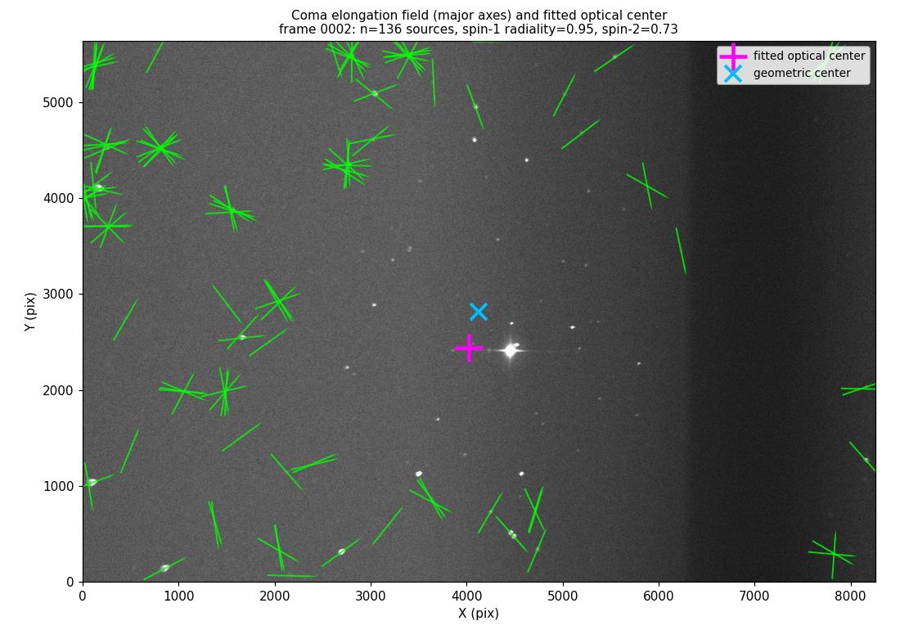
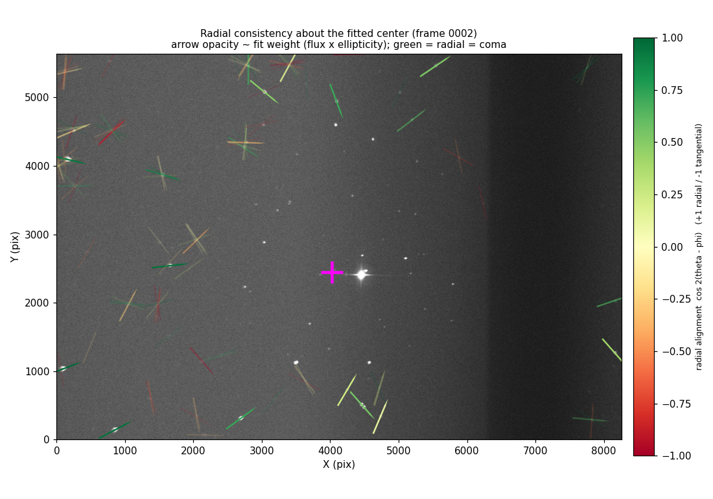

# Locating the optical center from coma — design & methodology

*MAST unit calibration · `src/imaging/optical_center.py`*

This note documents how a MAST unit recovers its **optical axis position on the
detector** ("optical center") from the **coma** of stars in a single night‑sky
image, the optical basis for the method, its implementation, and the literature
it draws on. It is written for review by an optics specialist.

> **Status (read first):** the method is grounded in the references below and
> has been exercised on a limited set of real frames. It has **not yet been run
> across our full range of images**, and we do not yet have a confirmed
> retracted, in‑focus calibration frame to fix the gate thresholds from the
> "clean coma" side. See [§6](#6-status--limitations).

---

## 1. Purpose & optical regime

Each MAST unit is a **0.6 m f/3 paraboloid imaged at (near) prime focus with no
field corrector.** For such a fast, uncorrected parabola the dominant off‑axis
aberration is **third‑order coma**: stellar images away from the axis develop
the familiar comet‑shaped flare, growing with distance from the field center and
pointing **radially**. This is precisely the regime illustrated by Jarvis,
Schechter & Jain (2008, hereafter **JSJ08**), Fig. 4 — "off‑axis comatic point
spread functions produced at the prime focus of a parabolic mirror… the size of
the PSF increases linearly with distance from the center of the field, and
points outward." (Survey telescopes add correctors that cancel this term; we
have none, so the coma is available as a *signal*.)

Because coma **vanishes on the optical axis** and **points radially everywhere
else**, the optical axis is the natural origin of the coma vector field. We
recover it as the point through which the stars' coma directions are radial.

---

## 2. Optical basis

### 2.1 Coma grows linearly with field angle and is radial

In Seidel (third‑order) theory the comatic wavefront term is

$$ W_{\text{coma}} = a_{C}\, H\, \rho^{3}\cos\phi, $$

with normalized field height $H$, pupil radius $\rho$, and pupil azimuth $\phi$.
The amplitude is **linear in the field height $H$** and vanishes on axis
($H=0$). For a single mirror at prime focus the transverse (angular) extent of
the comatic image scales as

$$ \varepsilon_{\text{coma}} \;\propto\; \frac{\theta}{(f/\#)^{2}}, $$

i.e. **linear in field angle $\theta$** and growing rapidly for a fast system
($f/\#=3$). The flare lies along the meridional (radial) direction — the line
from the star's field position **through the optical axis**. These two facts —
*amplitude $\propto$ field radius* and *orientation radial* — are what make the
optical center recoverable, and are corroborated across JSJ08, the standard
telescope‑optics treatment, and the empirical PSF studies cited below.

### 2.2 Coma is a spin‑1 vector, not a spin‑2 ellipse

A comatic PSF is **fully specified by an amplitude and a direction** and
combines by vector addition; JSJ08 state it "behaves like a vector." In the
spin‑weight classification used for field‑dependent aberrations (Kent 2018),
**coma is spin‑weight 1** while **astigmatism is spin‑weight 2**. The practical
consequence:

- A **spin‑2** quantity (e.g. an ellipse axis) is invariant under a $180°$
  rotation — it has an orientation but **no sense** (it is "headless").
- A **spin‑1** quantity (a vector) carries an **unambiguous direction** — here,
  *outward from the optical axis*.

This distinction drives the choice of estimators (§2.4): the ellipse second
moment gives a robust *orientation* (a spin‑2 proxy for the coma line), while
the odd/third‑moment **centroid shift** gives the true *outward sense* (spin‑1).

### 2.3 Second moments (spin‑2 orientation)

From the background‑subtracted intensity $I(\mathbf x)$ of a source, the
flux‑weighted second moments are

$$ Q_{ij} = \frac{\displaystyle\int I(\mathbf x)\,(x_i-\bar x_i)(x_j-\bar x_j)\,d^2x}{\displaystyle\int I(\mathbf x)\,d^2x}, $$

giving the (spin‑2) ellipticity and major‑axis orientation

$$ (e_1,e_2) = \frac{(Q_{xx}-Q_{yy},\; 2\,Q_{xy})}{Q_{xx}+Q_{yy}}, \qquad \theta = \tfrac12\,\operatorname{atan2}(e_2, e_1). $$

$\theta$ is the orientation of the comatic elongation, defined only modulo
$180°$.

### 2.4 The third‑moment / centroid‑shift signature (spin‑1)

Coma is an **odd** aberration: it displaces the **flux centroid off the
intensity peak**, along the comatic (radial) direction. We capture this as the
per‑source offset vector

$$ \mathbf{o} \;=\; \mathbf r_{\text{centroid}} - \mathbf r_{\text{peak}}, $$

which points **radially outward** from the optical axis and grows with field
radius. Unlike the spin‑2 ellipse, $\mathbf o$ is a genuine **vector**: it
resolves the outward sense and (as Ma et al. 2008 note for third moments)
breaks degeneracies that second moments alone cannot. It is, however, a *small*
offset (sub‑pixel to a few pixels) and therefore noisier to measure — which is
why we use it to **confirm** coma rather than to **locate** the center (§3).

### 2.5 Misalignment caveat (nodal aberration theory)

For a perfectly aligned, axially symmetric system the coma field is purely the
field‑linear Seidel term above. When elements are misaligned, vectorial / nodal
aberration theory shows an additional **field‑constant ("decentering") coma**
appears on top of it (Schechter & Levinson 2009; Noethe; Thompson). The on‑axis
null therefore remains the correct observable for the optical axis, but a
**residual constant coma** at the recovered center is a *diagnostic of
misalignment* — a quantity worth reporting in a future revision (§6).

---

## 3. Methodology / design

**Null‑finding principle.** Each star's coma axis is a line through its image
position $\mathbf p_i=(x_i,y_i)$ along the elongation direction $\theta_i$,
passing (anti‑)radially through the optical center $\mathbf p$. We recover
$\mathbf p$ as the point those lines best pass through.

**Weighted least‑squares intersection.** With each line's unit **normal**
$\mathbf n_i = (-\sin\theta_i,\ \cos\theta_i)$, the perpendicular distance from a
candidate center $\mathbf p$ to line $i$ is $\mathbf n_i\!\cdot(\mathbf p-\mathbf p_i)$.
Minimizing

$$ \chi^2(\mathbf p) = \sum_i w_i\,\big[\mathbf n_i\cdot(\mathbf p-\mathbf p_i)\big]^2 $$

gives the $2\times2$ normal equations

$$ M\,\mathbf p = \mathbf v,\qquad M=\sum_i w_i\,\mathbf n_i\mathbf n_i^{\!\top},\qquad \mathbf v=\sum_i w_i\,\mathbf n_i\,(\mathbf n_i\!\cdot\mathbf p_i). $$

This **normal‑vector form is numerically stable for all orientations**,
including near‑vertical axes (a naïve $\tan\theta$ slope form diverges there).

**Weighting.** The uncertainty in a source's measured orientation scales as
$\sim 1/(\mathrm{SNR}\cdot e)$, so we weight by

$$ w_i = \text{flux}_i \cdot e_i, $$

letting bright, clearly‑elongated stars dominate. (An earlier ellipticity‑only
weighting let faint, noise‑elongated sources wash out the signal.)

**Margin selection.** Since coma $\propto$ field radius, near‑axis stars carry
little directional signal (and noisy orientation). We use only sources beyond a
fraction `min_field_radius` of the maximum field radius — faster and less
noise‑prone.

**Robustness.** The fit iterates with **sigma‑clipping** on the perpendicular
residuals to reject outliers (blends, cosmic rays, non‑coma elongations).

**Confirmation metrics (the gate).** About the fitted center, with radial angle
$\varphi_i=\operatorname{atan2}(y_i-p_y,\,x_i-p_x)$, we compute two radiality
statistics:

$$ R_{2} = \big\langle\, w_i\cos 2(\theta_i-\varphi_i)\,\big\rangle \quad\text{(spin‑2, ellipse)}, \qquad R_{1} = \big\langle\, w_i\cos(\theta_{cp,i}-\varphi_i)\,\big\rangle \quad\text{(spin‑1, centroid–peak)}, $$

where $\theta_{cp,i}=\operatorname{atan2}(\mathbf o_i)$. Each runs from $+1$
(perfectly radial = coma), through $0$ (random orientation = no usable signal),
to $-1$ (tangential — e.g. tracking trailing or field rotation). **Spin‑1 is the
cleaner confirmation** (it tests the outward *sense*), but because the
centroid–peak offset is too small to *locate* the center well, the design is:
**the ellipse fits the center; spin‑1 (falling back to spin‑2 when too few
resolved offsets exist) gates the result.** A frame whose elongation field is
not radial returns *no answer* rather than a confident‑but‑meaningless centroid.

---

## 4. Code‑level walkthrough

All in [`src/imaging/optical_center.py`](../src/imaging/optical_center.py).

### `find_optical_center(...)` — the pipeline

```python
def find_optical_center(
    image,
    nsigma=2.0, npixels=5, box_size=50,        # detection
    min_area=10, max_area=1e5,                 # source size cuts
    min_ellipticity=0.05,                      # drop near-round (noisy orientation)
    min_field_radius=0.4,                      # use margin stars (coma ∝ field radius)
    middle_third=False,
    clip_sigma=3.0, max_iter=5,                # iterative outlier rejection
    min_sources=12,                            # enough spread stars
    min_radiality=0.25,                        # coma-signal floor (gate)
    exclude_mask=None,                         # e.g. folding-mirror shadow region
    plot_results=False,
) -> OpticalCenterResult | None:
```

Steps, numbered as in the source:

1. **Load** the image (FITS path or array).
2. **Background** subtraction with `photutils` `Background2D` + `MedianBackground`.
3. **Detect** sources via `detect_threshold` / `detect_sources` (segmentation);
   `exclude_mask` keeps a folding‑mirror shadow region out of detection so its
   leak‑through ghosts never enter the fit.
4. **Measure** with `SourceCatalog`: per‑source `xcentroid/ycentroid` ($x,y$),
   `orientation` ($\theta$), `ellipticity` ($e$), `segment_flux`, and
   `maxval_xindex/maxval_yindex` (the **peak pixel**, for the spin‑1 offset
   $\mathbf o = \text{centroid}-\text{peak}$).
   - **4a. Filter**: area in `[min_area, max_area]`, finite $\theta$,
     $e\ge$ `min_ellipticity`, and the **margin cut** $r_i \ge$
     `min_field_radius` $\cdot\,r_{\max}$.
5. **Fit** (§3): weight $w_i=\text{flux}_i\cdot e_i$, solve via `_solve_center`,
   sigma‑clip, repeat.
6. **Gate** (§3): require enough sources and a radial elongation field
   (`_coma_radiality`), else return `None`.

### `_solve_center` — the normal‑equation intersection

```python
nx = -np.sin(theta)
ny = np.cos(theta)  # line normals n_i
ndotp = nx * x + ny * y
mxx = np.sum(weights * nx * nx)
mxy = np.sum(weights * nx * ny)
myy = np.sum(weights * ny * ny)
vx = np.sum(weights * nx * ndotp)
vy = np.sum(weights * ny * ndotp)
m = np.array([[mxx, mxy], [mxy, myy]])
v = np.array([vx, vy])
px, py = np.linalg.solve(m, v)  # M p = v
residuals = nx * (px - x) + ny * (py - y)  # signed perpendicular distances
```

This is exactly $M\mathbf p=\mathbf v$ from §3, in the stable normal‑vector form.

### `_coma_radiality` — spin‑2 and spin‑1 confirmation

```python
rad = np.arctan2(y - py, x - px)  # φ_i
radiality = np.sum(weights * np.cos(2 * (theta - rad))) / np.sum(weights)  # R2 (spin-2)
ox, oy = x - peak_x, y - peak_y  # centroid - peak = o
omag = np.hypot(ox, oy)
cp_ok = omag > 0.5  # drop sub-pixel (quantization)
if cp_ok.sum() >= min_sources and np.sum((flux * omag)[cp_ok]) > 0:
    theta_cp = np.arctan2(oy[cp_ok], ox[cp_ok])
    spin1 = np.sum((flux * omag)[cp_ok] * np.cos(theta_cp - rad[cp_ok])) / ...  # R1 (spin-1)
    return radiality, spin1, spin1, "spin-1 (centroid-peak)"  # gate on spin-1 when available
return radiality, float("nan"), radiality, "spin-2 (ellipse)"  # else fall back to spin-2
```

### Result object

`OpticalCenterResult` carries the answer plus provenance/quality for the
per‑unit calibration record: `center_x, center_y`, `n_sources, n_detected`,
`residual_rms`, `radiality` ($R_2$), `radiality_spin1` ($R_1$), `image_shape`,
and (for inspection) the per‑source `x, y, theta, weight` arrays.

---

## 5. Example figures

Generated from a real frame (`Samples1/0002`) with the production
`find_optical_center` (136 margin sources used; **spin‑1 radiality $R_1=0.95$**,
spin‑2 $R_2=0.73$).

**Coma elongation field and the recovered center.** Green ticks are the
major‑axis orientations of the selected margin stars; magenta `+` is the fitted
optical center, cyan `×` the geometric frame center.



**Radial consistency.** The same field with each tick colored by its alignment
to the radial direction about the fitted center, $\cos 2(\theta-\varphi)$
(green = radial = coma, red = tangential), and **arrow opacity scaled by the fit
weight** ($\text{flux}\times e$) so the prominent ticks are the ones the fit
actually trusts. The high‑weight ticks are coherently green — the visual
statement of "this is coma, and it points at *this* center" — while faded faint
sources carry little weight (and explain why the per‑source spin‑2 $R_2=0.73$ is
lower than the weighted, sense‑resolving spin‑1 $R_1=0.95$).



---

## 6. Status & limitations

- **Coverage.** Exercised on a limited set of real frames; **not yet run across
  our full range of images.** Thresholds (`min_radiality`, `min_sources`,
  `min_field_radius`) are set conservatively and are **not yet calibrated from a
  confirmed retracted, in‑focus frame** (the "clean coma" reference).
- **Per‑frame scatter.** On the frames seen, repeated estimates of the same
  field scatter by order $10^2$ px. As the optical center is a *fixed* per‑unit
  quantity, this is **measurement noise of the coma‑null fit**, not a moving
  target. The intended per‑unit value is therefore obtained by **aggregating
  many frames** (pooling sources or robustly averaging per‑frame centers), not
  from a single frame.
- **Identified next steps.** (i) Separate the **field‑constant coma**
  (misalignment, §2.5) from the field‑linear term and report the decenter as a
  calibration output; (ii) add a **rho‑statistic** residual‑elongation
  diagnostic (the weak‑lensing standard, §7) and a formal uncertainty on the
  center; (iii) validate the gates against an in‑focus reference frame.

---

## 7. References

**Direct basis for the coma method**

- **Jarvis, M., Schechter, P. L., & Jain, B. (2008)** — *Mass–sheet
  degeneracy… and the comatic PSF of a parabolic mirror.* arXiv:0810.0027.
  Coma is a spin‑1 vector, grows linearly with field angle, points radially,
  vanishes on axis, and shifts the centroid. **Primary reference.**
- **Ma, Z., Bernstein, G., Weinstein, A., & Sholl, M. (2008)** — *Diagnosing
  space telescope misalignment and jitter using stellar images.*
  arXiv:0809.2954. Fitting **third moments** (alongside second) gives a better
  handle on coma and breaks the translation/rotation degeneracy.
- **Schechter, P. L., & Levinson, R. S. (2009)** — *Generic misalignment
  aberration patterns in wide‑field telescopes.* arXiv:1009.0708. Misalignment
  adds a **field‑constant decentering coma**.

**Methodological context**

- **Noethe, L. (2002)** — *Active optics in modern large optical telescopes.*
  arXiv:astro‑ph/0111136. Field dependence of aberrations; binodal astigmatism.
- **Kent, S. M. (2018)** — *Lateral color and spin‑weighted Zernike
  polynomials.* PASP; arXiv:1711.03916. Field‑dependent aberrations as
  spin‑weighted Zernikes (coma = spin‑1, astigmatism = spin‑2).
- **Rowe, B. (2010)**; **Jarvis, M., et al. (2016)** — **rho‑statistics**: the
  two‑point correlation of residual PSF ellipticity used to validate PSF/
  ellipticity‑field models (weak‑lensing standard).
- **Liaudat, T., et al. (2023)**, *Front. Astron. Space Sci.*; **Schmitz, M.,
  et al. (2020)**, *A&A* 636, A78 — field‑dependent PSF modeling / interpolation
  (the same spin‑2 ellipticity‑field problem, transferable tooling).

*Mapping:* JSJ08, Ma08, and Schechter–Levinson09 directly ground the coma‑null
method and its estimators; the remaining entries are methodological context
(nodal‑aberration framing, spin‑weighted formalism, and validation diagnostics)
that inform the planned next steps in §6.
